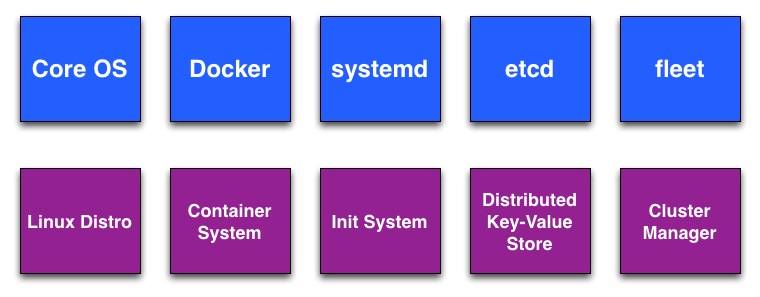
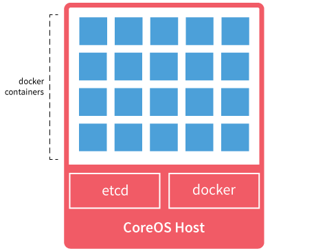

!SLIDE center

### anders.janmyr@jayway.com
### http://anders.janmyr.com
### @andersjanmyr

!SLIDE center
# Core OS Components

!SLIDE center
# Core OS Linux distro

!SLIDE bullets
# Core OS Linux distro

* Minimal 114MB RAM on boot
* No package manager, Docker
* Dual-partition scheme
  * Read-only boot partitions
  * Upgrade to passive partition
  * Safe Roll Back
* Managed Linux

!SLIDE center
# Docker

!SLIDE bullets
# Docker

*
*

!SLIDE center
# systemd

!SLIDE bullets
# systemd

!SLIDE code small
# systemd, unit-file

    @@@ ini

    [Unit]
    Description=MyApp
    After=docker.service
    Requires=docker.service

    [Service]
    TimeoutStartSec=0
    ExecStartPre=-/usr/bin/docker kill busybox1
    ExecStartPre=-/usr/bin/docker rm busybox1
    ExecStartPre=/usr/bin/docker pull busybox
    ExecStart=/usr/bin/docker run --name busybox1 busybox \
      /bin/sh -c "while true; do echo Hello World; sleep 1; done"

!SLIDE code small
# systemd, servicectl

    @@@ sh
    # Enable and start the service
    $ sudo systemctl enable /etc/systemd/system/hello.service
    $ sudo systemctl start hello.service

    # Read the logs
    $ journalctl -f -u hello.service
    $ docker ps
    $ docker logs <container_id>

!SLIDE center
# etcd

!SLIDE bullets
# etcd

!SLIDE center
# fleet

!SLIDE bullets
# fleet

!SLIDE code small
# fleet, unit-file

    @@@ ini
    [Unit]
    Description=My Apache Frontend
    After=docker.service
    Requires=docker.service

    [Service]
    TimeoutStartSec=0
    ExecStartPre=-/usr/bin/docker kill apache1
    ExecStartPre=-/usr/bin/docker rm apache1
    ExecStartPre=/usr/bin/docker pull coreos/apache
    ExecStart=/usr/bin/docker run -rm --name apache1 -p 80:80 \
      coreos/apache /usr/sbin/apache2ctl -D FOREGROUND
    ExecStop=/usr/bin/docker stop apache1

    [X-Fleet]
    Conflicts=apache@*.service
